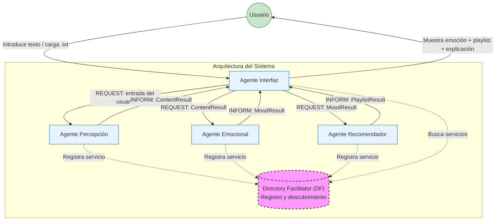

# SSII-PRACTICA-JADE

# Recomendador Musical por Estado de Ánimo - Sistema Multiagente JADE

Sistema inteligente multiagente desarrollado con **JADE** que analiza el tono emocional de un texto (noticia, artículo, reflexión, etc.) y recomienda una playlist de 3 canciones acorde al estado de ánimo detectado.

---

## 📋 Descripción del Proyecto

El usuario introduce un texto o carga un fichero `.txt`. El sistema procesa la información a través de cuatro agentes que se comunican entre sí:

- **Agente Interfaz**: Gestiona la GUI y coordina el flujo.
- **Agente Percepción**: Extrae el texto.
- **Agente Analizador Emocional**: Detecta la emoción dominante (Alegría, Tristeza, Calma, Tensión o Neutro).
- **Agente Recomendador Musical**: Recomienda 3 canciones según la emoción.

---

## 🛠️ Tecnologías y Dependencias

- **Lenguaje**: Java 8 o superior
- **Framework**: JADE 4.6.0
- **IDE Recomendado**: Eclipse IDE
- **Bibliotecas externas**:
  - JADE (jade.jar + jadeTools.jar)
  - JSoup (para extracción de URLs - opcional)

### Dependencias necesarias para desarrollo en Eclipse
Asegúrate de tener en tu proyecto las siguientes librerías en el **Build Path**:

- `jade.jar`
- `jadeTools.jar`
- `commons-codec.jar` (si es necesario)
- `jsoup.jar` (opcional)

---

## 🚀 Instrucciones de Instalación

1. Clonar o descargar el repositorio.
2. Importar el proyecto en **Eclipse** como "Existing Java Project".
3. Asegurarse de que las librerías de JADE estén correctamente configuradas en el **Build Path**.

   
## 🚀 Instrucciones de Ejecución

1. Abrir el proyecto en Eclipse.
2. Ejecutar la clase principal:  
   **`es.upm.practica.MainLauncher`** (Run as → Java Application).
3. Se abrirán automáticamente:
   - La **GUI de JADE** (Remote Agent Management GUI)
   - La ventana de la aplicación **"Recomendador Musical por Estado de Ánimo"**.

## Datos de ejemplo (qué texto o moods puede introducir el usuario para probarlo).
Puedes encontrar ejemplos de textos de prueba en la carpeta pruebas.

## 🏗️ Arquitectura del Sistema

**Agentes:**
- **AgenteInterfaz** → Coordina el flujo y muestra la GUI
- **AgentePercepcion** → Obtiene el texto (entrada usuario o .txt)
- **AgenteAnalizadorEmocional** → Detecta la emoción dominante
- **AgenteRecomendadorMusical** → Recomienda 3 canciones

## Declaración de IA (cómo la hemos usado, si la hemos usado).
